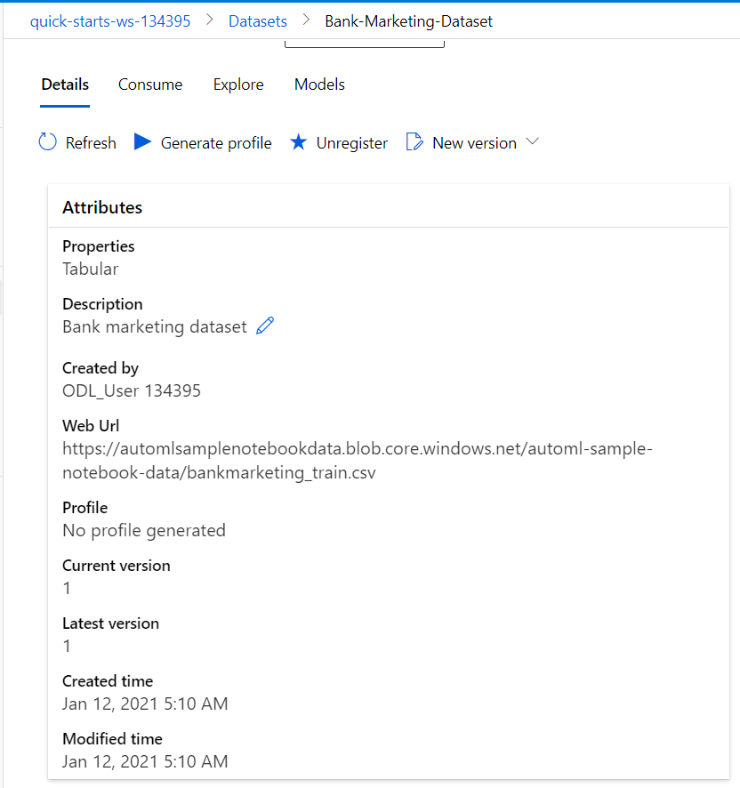

# Operationalizing Machine Learning

## Project Overview

The project focuses on creating a workflow of a machine learning ecosystem and then operationalizing it to make the process of re-training, publishing endpoints and troubleshooting easier.

## Architectural Diagram

## Key Steps

1. Add Dataset

2. Create a pipeline and a run with bank-marketing-dataset

3. After Completion of pipeline extract best model

4. Deploy best model and get endpoints along with enabling insights

5. Publish Pipeline,Get endpoints and submit another run

6. Submitting run via published pipeline endpoint

7. Checking submitted runs on experiments

8. Checking the completion in notebook

9. Checking Pipeline Endpoints

10. Creating Swagger doc to see api-endpoints and hit right away through it

11. Finally running tests,benchmarks and checking logs on deployed-model api

Endpoint Test

Enabling logs

Running Benchmarks

## Screen Recording

## Standout Suggestions

1. Accuracy can be improved by solving the class-imbalance issue of the dataset used.
2. Number of cross-validations can be increased for better results.
3. Using more powerful tools like Deep-learning can definitely lead to better performance.
