# Operationalizing Machine Learning

## Project Overview

The project focuses on creating a workflow of a machine learning ecosystem and then operationalizing it to make the process of re-training, publishing endpoints and troubleshooting easier along with deploying the model as a service, and consume the endpoints of the service by making predictions.

## Architectural Diagram

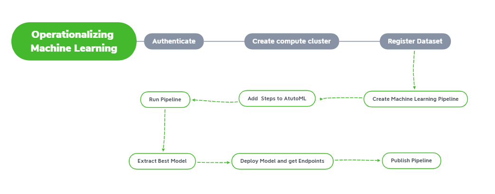

## Key Steps

1. <B>Add Dataset</B>

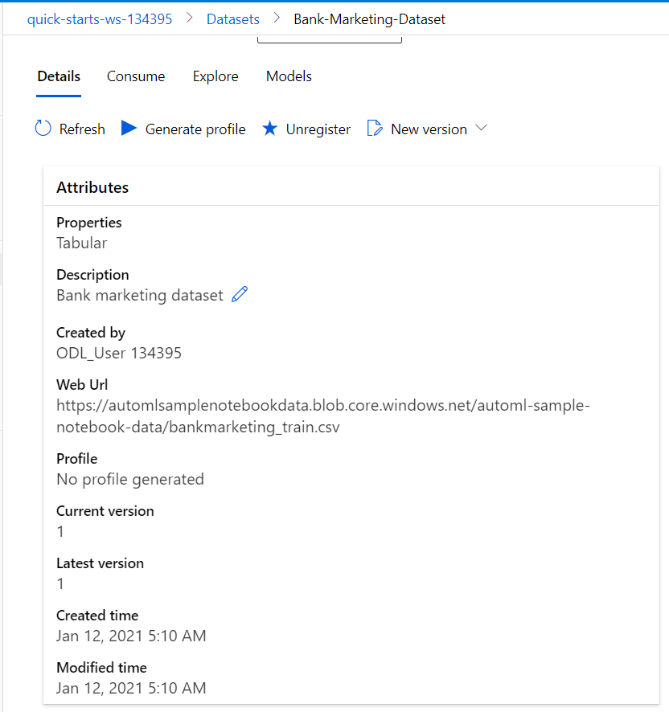

2.<B>Create a pipeline and a run with bank-marketing-dataset </B>

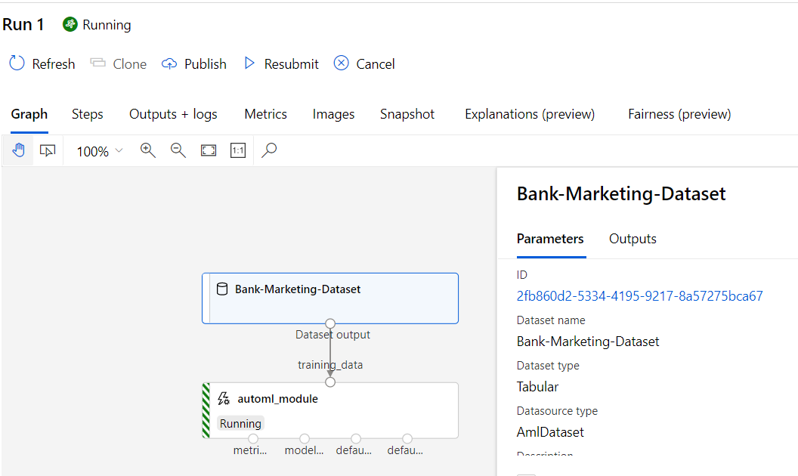

3. <B>After Completion of pipeline extract best model</B>

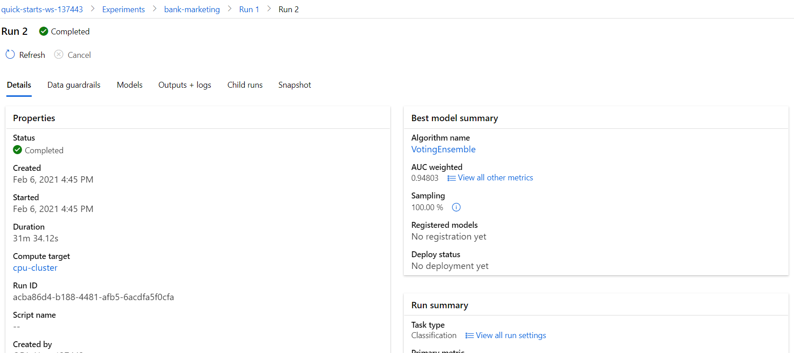

4. <B>We choose the best model for deployment and enable "Authentication" while deploying the model using Azure Container Instance (ACI). The executed code in logs.py enables Application Insights. "Application Insights enabled" is disabled before executing logs.py.</B>

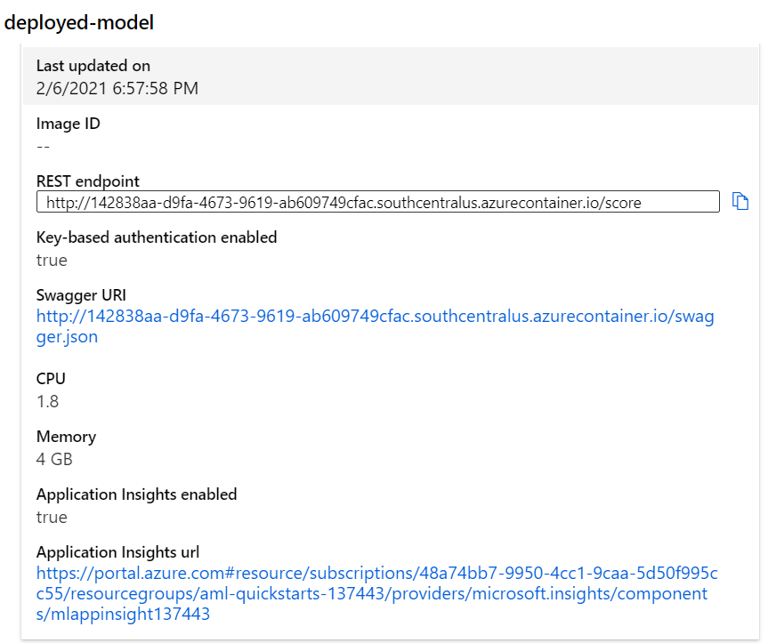

5. <B>Publish Pipeline,Get endpoints and submit another run</B>

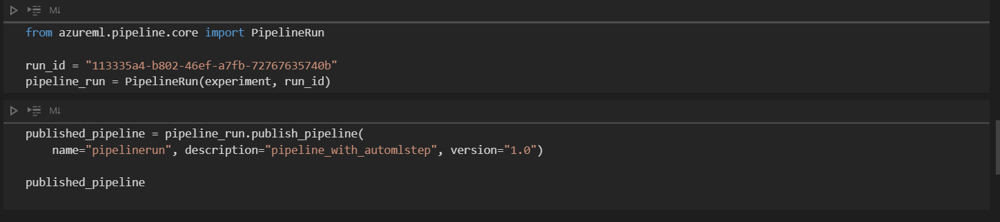

6.<B> Submitting run via published pipeline endpoint </B>

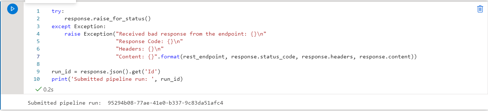

7.<B> Checking submitted runs on experiments </B>

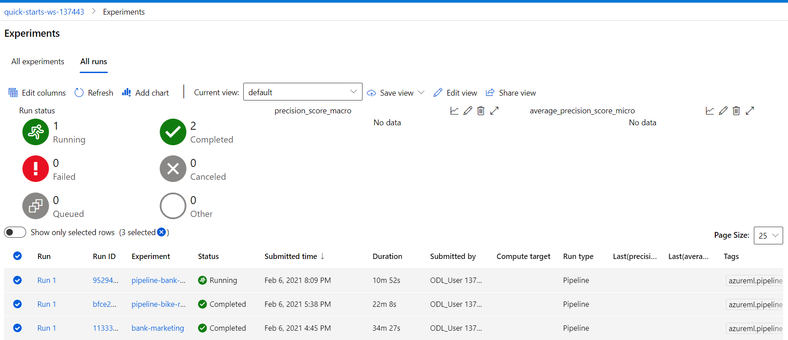

8. <B>Checking the completion in notebook </B>

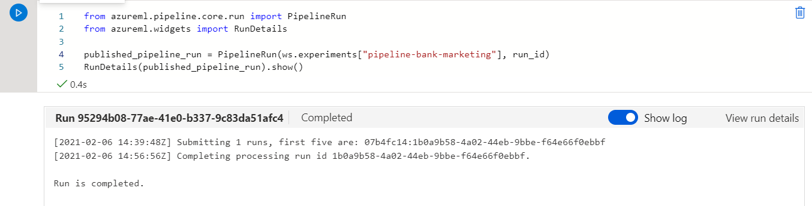

9. <B>Checking Pipeline Endpoints </B>

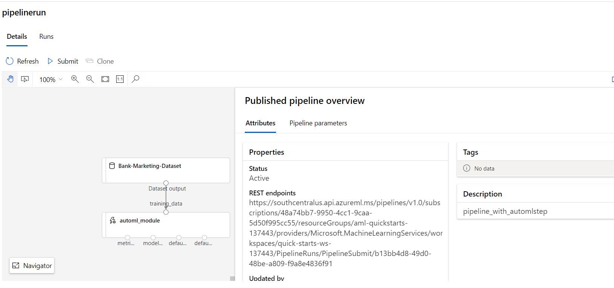

10.<B> Checking Active Pipeline Endpoints </B>
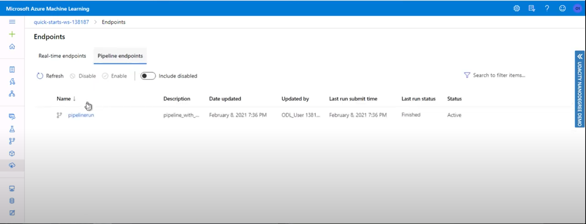

11.<B> Checking Scheduled Runs made via pipeline endpoint </B>
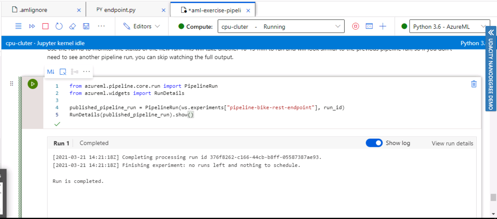

12. <B>Creating Swagger doc to see api-endpoints and hit right away through it </B>

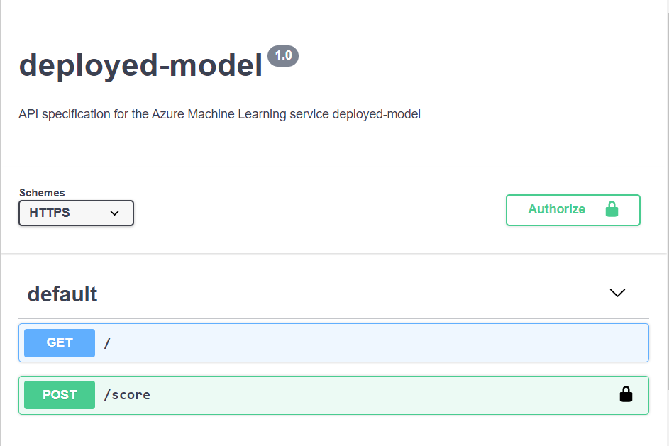

13.<B> Finally running tests,benchmarks and checking logs on deployed-model api </B>

14.<B> Endpoint Test </B>

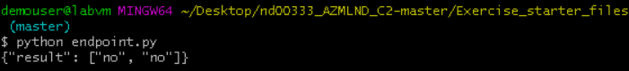

15.<B> Enabling logs </B>

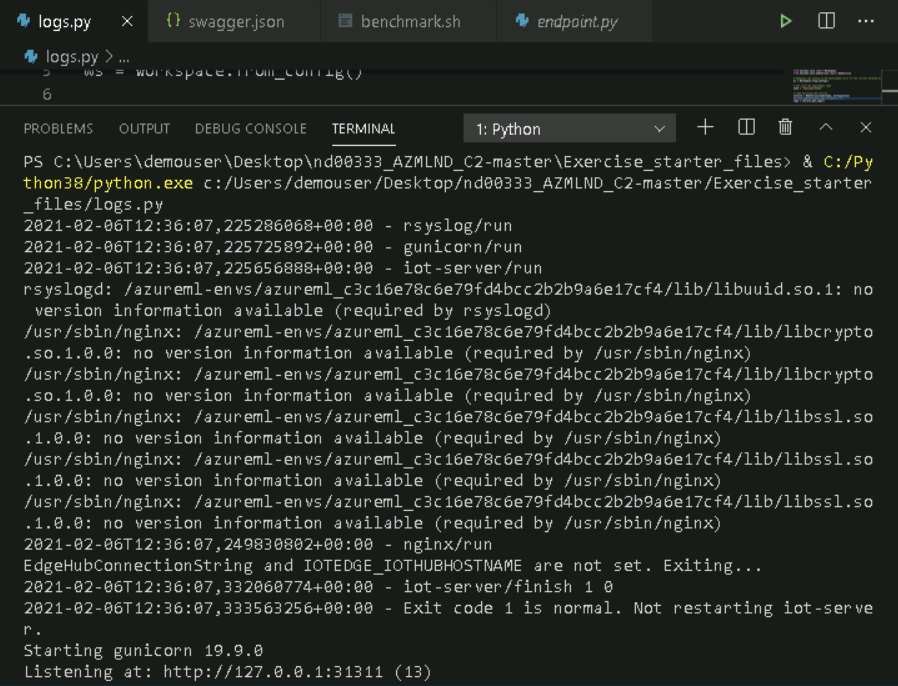

16.<B> Running Benchmarks </B>

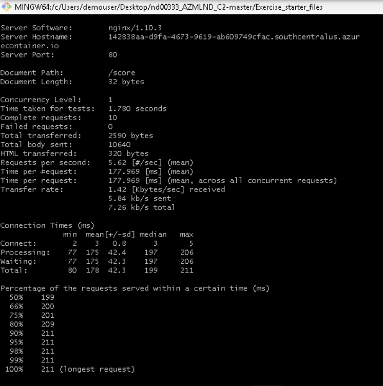

## Screen Recording

## Future Improvement Suggestions

1. Accuracy can be improved by solving the class-imbalance issue of the dataset used.
2. Number of cross-validations can be increased for better results.
3. Using more powerful tools like Deep-learning can definitely lead to better performance.
4. Dataset may contain some non-realworld data or outdated ones which could be changed or removed to make the trained model do more accurate predictions.
